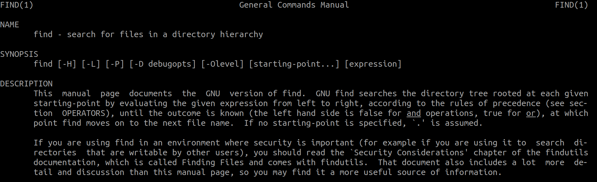

# 1. Introducción

Durante nuestro día a día puede llegar el momento en el que necesitos buscar elementos sobre nuestro sistema de archivos en GNU/Linux. Si bien es cierto que existen diferentes comandos, como _which_, _whereis_ o _locate_, en este documento repasaremos brevemente el comando _find_.


# 2. El comando find

El comando _find_ es muy importante ya que dispone de varias opciones para poder afinar la búsqueda de aquello que buscamos.A continuación veremos varias de dichas opciones y ejemplos de uso junto a su explicación.

Lo primer que debemos recordar es que para acceder a la ayuda, usaremos el comando _man_.

```
$ man find
```

y obtendremos lo mostrado en la siguiente imagen.



## 2.1 Opciones del comando find

La sintaxis del comando será

```
$ find ruta opciones [ok|exec {}] \;
```
Partiendo de la siguiente estructura de directorios realizaremos algunos ejemplos para explicar algunas de las opciones del comando.

\begin{center}
  \includegraphics[width=200pt,height=200pt]{img/02.png}
\end{center}


**type**

La opción _type_ nos sirve para indicar si queremos buscar ficheros, directorios, enlaces, bloques, etc. A continuación algunos ejemplos.

```
$ find . -type f # Búsqueda de ficheros regulares.
$ find . -type d # Búsqueda de directorios.
$ find . -type l # Búsqueda de enlaces simbólicos o blandos.
$ find . \( -type f -o -type d \) # Búsqueda de ficheros regulares y directorios.
```

**name**

La opción _name_ nos permite definir el nombre o un patrón para el nombre de aquellos ficheros que estamos buscando en nuestro sistema de archivos.

```
$ find . -name 'prueba.txt' # Busca fichero que tengan ese nombre.
$ find . -name '*.txt' # Busca ficheros que tengan extensión txt.
$ find . -name 'prueba.*' # Busca ficheros que se llamen prueba.
$ find . \( -name '*.txt' -o -name 'prueba.*' \) # Busca fichero que tengan extensión 
txt o se llamen prueba con cualquier extensión.
```

**size**

La opción _size_ nos permite definir la capacidad que ocupa el fichero que buscamos. A continuación algunos ejemplos.

```

```

**perm**

La opción _perm_ nos permite definir los permisos de aquel fichero que estamos buscando. A continuación algunos ejemplos.


**mtime**

```

```

**user**

La opción _user_ nos permite definir el usuario propietario de aquellos ficheros que estamos buscando. A continuación algunos ejemplos.

```

```

**maxdepth**

La opción _maxdepth_ nos permite definir el nivel máximo de niveles a los que queremos que acceda la herramienta _find_ a buscar. A continuación algunos ejemplos.

```

```

**empty**

La opción _empty_ nos permite definir que la busqueda se refiere a un elemento vacío.

```
$ find . empty # Busca ficheros que estén vacíos.
```

**link**

```

```

**mmin**

```

```

**ok**

```

```

**exec**

```

```


## 2.2 Combinar varias opciones

Para llevar a cabo la combinación de varias opciones debemos hacer uso de -and (Y) y -or (OR). A continuación se muestran algunos ejemplos de ejecución.

```
$ find . \( -type f -o -type d \) -and \( -name 'prueba.txt' -or -name '*.jpg' \)

# Se buscará ficheros regulares y directorios que 
# tengan por nombre prueba.txt o cualquier nombre pero extensión jpg.

$ find . -type f \( -name '*.txt -or -name'*.pdf \) -and \( -size +2M -and 
-size -5M \)

# Se buscará ficheros regulares cuyo nombre tenga 
# extensión txt o pdf y el tamaño usado en disco esté comprendido entre 2MB y 5MB.
```


# 3. Actividades

A continuación se debe crear un comando find que cumpla lo que se indica para cada caso:

- Muestra los ficheros regulares que hay en el directorio home de tu usuario.
- Muestra los directorios que hay en el directorio home de tu usuario.
- Muestra los ficheros y los directorios que hay en el directorio home de tu usuario.
- Muestra los ficheros regulares que tengan por nombre info.txt
- Muestra los ficheros regulares que tengan por nombre info con cualquier extensión.
- Muestra los ficheros regulares que estén vacíos.
- Muestra los directorios que estén vacíos.
- Muestra los directorios cuyo nombre sea _pruebas_.
- Muestra los ficheros cuyo nombre sea alberto.txt o claves.pdf.
- Muestra los ficheros cuyo nombre tenga extensión _txt_ o _pdf_.
- Muestra los ficheros que ocupen más de 1MB.
- Muestra los ficheros que ocupen más de 1MB y menos de 4MB.
- Muestra los ficheros cuyo nombre tenga extensión _txt_ o _pdf_ y además estén entre el rango de 10MB y 50MB.
- Muestra los enlaces duros
- Muestra los ficheros que tengan permisos de ejecutar.
- Elimina los ficheros _txt_.
- Elimina los directorios vacíos.
- Copia los ficheros _jpg_ a un directorio llamado _backup_ que debe screar antes.
- Haz una búsqueda de ficheros _mp3_ con un máximo de dos niveles de profundidad.
- Repite la anterior añdiendo un filtro de menores de 3MB.
- Muestra los ficheros que han sido modificados hace menos de cuatro días.
  
